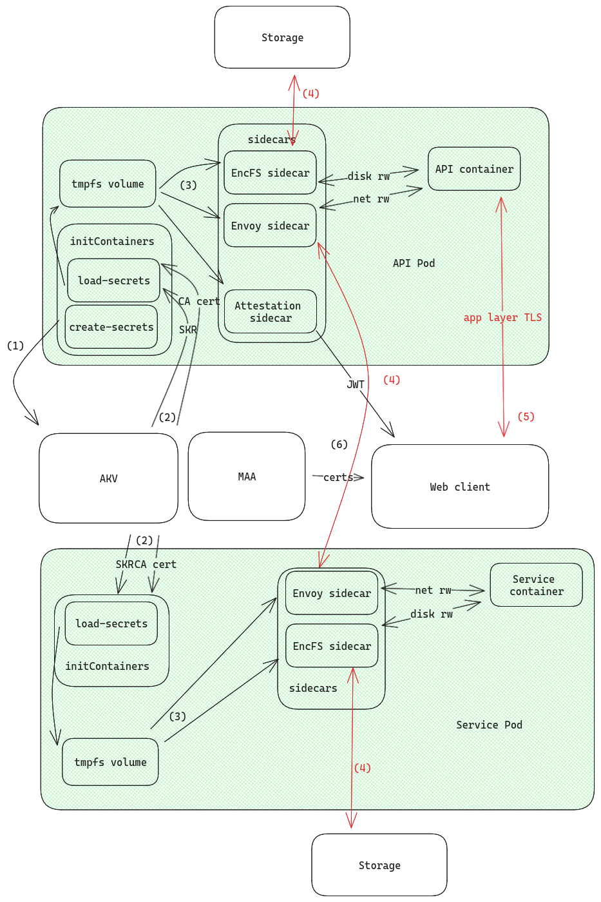

# Architecture

The following diagram showcases how the cluster is set up to leverage AKS-CC to guarantee confidentiality.

We only show one example service in the diagram, but any other service would be configured in the same way.

The components that belong to the trusted computing base (TCB) are highlighted in green (the Kata confidential pods running on AMD SEV-SNP capable nodes).

At first, two types of initContainers will be run in this sequence:

- `create-secrets` (API only)
- `load-secrets`

**(1)** `create-secrets` is in charge of creating the mHSM in Azure and initializing the master secret, upon which the confidentiality of the system relies, and uploading it to the mHSM.

The mHSM is created with purge protection on, making it impossible for a malicious susbcription owner to delete and replace the vault and the master secret.

At the moment, the mHSM security domain is be created with a set of private keys that will be thrown away as soon as the initContainer finishes its execution. This guarantees that no one can access the master secret, not even Microsoft or the subscription owner.

The master secret will have an immutable secure key release (SKR) policy, which only allows the confidential pods to access it.

Additionally, as we cannot attest the immutability of the allowed operations for the master secret in AKV, we deterministically derive another intermediate secret from the master secret, which will be the actual key used to encrypt the remote filesystem and issue TLS certificates.

With this intermediate secret, we create and store a CA certificate in the mHSM.

**(2)** In each pod, `load-secrets` downloads the master secret and the CA cert from the mHSM and stores them in an in-memory `tmpfs` volume shared with the rest of the pod, so that the other containers can access them without leaving the TCB.

The container derives the intermediate secret in the same way the API did, and then asserts that the CA certificate is correctly derived from it, since Microsoft does not support SKR for AKV certificates yet.

Once this verification is done, it self-issues a TLS certificate using the CA and stores it in the `tmpfs` volume alongside the other certs and keys.

**(3,4)** The EncFS and Envoy sidecars pick up the CA cert and the intermediate secret from the `tmpfs` volume and set up mTLS and the remote filesystem (only accepting connections with certs isssued by the same 'secret' CA).

The API pod also spins up a Remote Attestation sidecar, with which the web client can get a report that attests the integrity of the whole cluster.

**(5)** The web client communicates with the API via a custom app-layer encryption protocol similar to aTLS. To this end, the attestation sidecar will also include a hash of its TLS certificate in the report, binding the certificate to the code integrity guarantees.

In this way the end user does not need to manually check the certificate in their browser, as the client code will do it for them.

The web client is source-mapped and hosted on IPFS, so that the frontend is immutable and auditable.

This setup guarantees to the user that no uninted third party can access their raw private data.
